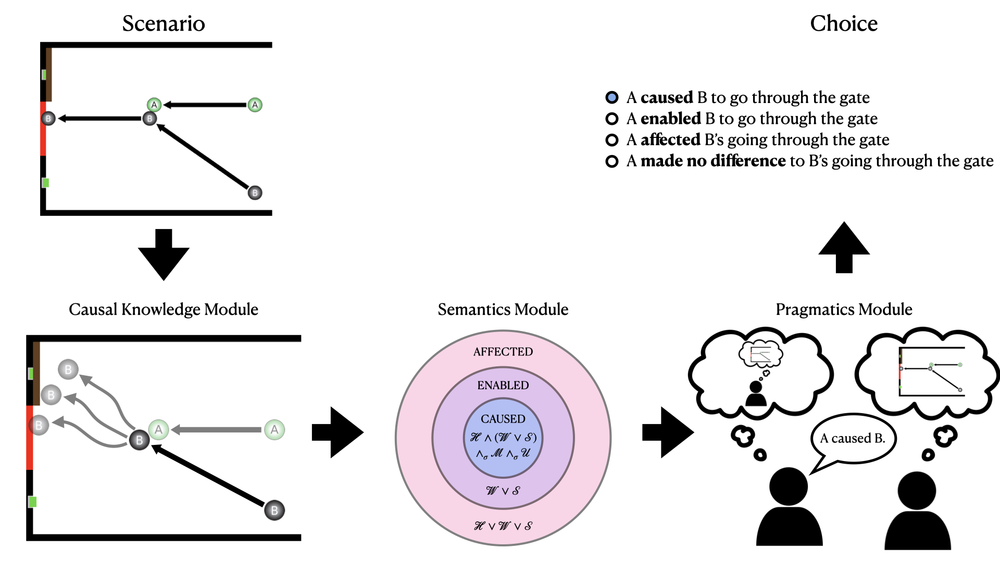

# A counterfactual simulation model of causal language

This repository contains materials for the [paper](https://osf.io/preprints/psyarxiv/xv8hf) "A counterfactual simulation model of causal language" by Ari Beller and Tobias Gerstenberg.

## Introduction

<div align="center"></div>

The way that we communicate a causal story shapes the image a listener brings to mind. Saying that the doctor "killed" the patient as opposed to the doctor "caused the patient to die" will suggest differing degrees of moral responsibility on the part of the doctor. Understanding how these subtle differences in language result in major differences in interpretation is a multi-disciplinary project at the intersection of philosophy, linguistics, and psychology. In this work we develop a model that links people's choice of causal expressions with their underlying causal representations on the world. We model people's causal knowledge using the Counterfactual Simulation Model (CSM), a quantitative model of people's causal judgment. The CSM posits multiple causal features called asepcts of causation. These aspects serve as the basis of a semantics for causal expressions. We define the causal expressions "caused", "enabled", "affected", and "made no difference" as logical combinations of the aspects of causation. Because different causal expressions recruit the same aspects in their definitions, we need some way to determine which of multiple true utterances is appropriate in context. We use the Rational Speech Acts framework (RSA) to select utterances that are both true and informative in context.

We test our model in a series of experiments. In a first set of psycholinguistic studies (Experiment 1) we validate the semantic and pragmatic assumptions of our model. We show that the three causal expressions "caused", "enabled", and "affected" form a hierarchy of informativity with "caused" being the most informative and "affected" being the least. We then proceed to show that participants exhibit pragmatic behavior in line with the predictions of our model. We follow these qualitative validations of our model with two quantitative tests. In a speaker task (Experiment 2) and a listener task (Expeirment 3) involving dynamic causal physical scenarios, we show that our model makes quantitative predictions that match the distribution of participant responses in both these settings. We compare our model to two lesioned alternatives, one that removes the pragmatic inference component of the full model, and another that removes both the pragmatic inference and the semantic knowledge of the first model. We show that the full model outperforms these two alternatives in both the speaker and the listener setting indicating that causal knowledge, semantics, and pragmatics are all important for understanding how people use causal language.

## Preregistrations

Preregistrations for all studies in Experiment 1 are available on the Open Science Framework:

- [Experiment 1A (norming study)](https://osf.io/kx5fg)
- [Experiment 1B (semantics study)](https://osf.io/2un9v)
- [Experiment 1C (pragmatics study)](https://osf.io/ak5yd)

## Repository Structure

```
.
├── README.md
├── code
│   ├── R
│   ├── experiments
│   └── python
├── data
│   ├── experiment1
│   ├── experiment2
│   └── experiment3
├── docs
└── figures
    ├── paper_figures
    └── trial_schematics
    └── trial_schematics
```

### code

#### experiments

Contains code for experiment 1 (psycholinguistics studies), experiment 2 (speaker experiment), and experiment 3 (listener experiment).

Studies from experiment 1 can be run here:

- [Experiment 1A: Norming Study](https://cicl-stanford.github.io/causal_language/norming_study/)
- [Experiment 1B: Semantics Study](https://cicl-stanford.github.io/causal_language/semantics_experiment/)
- [Experiment 1C: Pragmatics Study](https://cicl-stanford.github.io/causal_language/pragmatics_experiment/)

Experiments 2 and 3 require [psiturk](https://psiturk.org/). Refer to the [documentation](https://psiturk.readthedocs.io/en/latest/) for an illustration of how to run them.

#### python

Contains code for running the counterfactual simulation model, computing semantic representations, and performing pragmatic inference. Also includes code for running parameter search and running cross-validation.

1. `model.py` contains all the code for the counterfactual simulation model. This includes a physics engine that supports simulation, and code for running different counterfactual tests. 

2. `rsa.py` contains the model semantics and code for performing pragmatic inference.

3. `speaker_fitting.py` Fits the speaker model for the Full Model and No Pragmatics Model and runs cross-validation. Output is written to the model_performance folder. Fitting for the No Semantics and No Pragmatics Model is performed in R.

4. `listener_fitting.py` Fits the listener model for all model variations and runs cross-validation. Output is written to the model_performance folder.

5. `semantics_analysis.py` contains code for a supplementary analysis where we determine the set of all semantics that are consistent with the results from Experiment 1 and then evaluate each semantics to see which best fits our data.

6. `semantics_ranking.csv` output rankings for the different semantics from `semantics_analysis.py`

7. `crossv_splits.pickle` a pickle file recording the trial division for all 100 splits of the cross validation in the speaker task.

8. `trialinfo` a folder containing json files which specify the initial conditions of the trials in experiment 2, the attention check trials in experiment 3, and the training trials in experiment 3. Particular trials can be run with procedures from the `model.py` file.

9. `aspects_paper` a folder containing precomputed aspect representations for each of the trials for different values of uncertainty noise. 1000 simulations were run for each world for both the whether and sufficiency tests. 

10. `model_performance` a folder containing saved model performance. All fitting and cross validation scripts write the output to this folder. Analysis files in R read model performance from this folder.

#### R

1. `analysis.Rmd` is the primary analysis file. Contains analyses and visualizations for all experiments in the paper. Also contains code for fitting the ordinal regression model in experiment 2. You can view rendered analysis [here](https://cicl-stanford.github.io/causal_language/analysis/index.html).

2. `crossv_ordreg.R` is a script for fitting the regression model for a particular split in the cross validation. Unlike the primary regression model from experiment 2, the regression model in this file has no random intercepts for trials because trials are not shared across train and test.

3. `crossv_splits.csv` is a record of the trials in train and test for each split for the cross validation.

4. `regression` a folder containing saved regression files for all regressions computed with brms. This includes ordinal regressions computed for analysis in Experiment 1, as well as model regressions for different noise values computed in experiment 2. Regressions computed for cross validation in experiment 2 were computed on Stanford's compute cluster and are not included in this repo.

5. `splits` performance of each regression model at each noise value on train and test for each split in the cross validation.

### data

Contains raw data files and csvs for each of the experiments.

### docs

The docs folder hosts the studies from Experiment 1.

### figures

1. `paper_figures` contains data visualizations generated in R and included in the paper.

2. `trial_schematics` includes static visualizations of the trials from experiment 2.

## Replicating paper results

### Experiment 1
All code for data-wrangling and analysis in Experiment 1 is provided in the [analysis](https://cicl-stanford.github.io/causal_language/analysis/index.html) file in `code/R/analysis.Rmd`.

### Experiment 2

#### Generate causal aspects
The base level of the model is the causal aspect representations for the trials in the speaker experiment. `model.py` contains code to compute these representations. Pre-computed aspect values for noise values ranging from 0.5 to 1.6 in increments of 0.1 computed with 1000 samples are provided in `aspects_paper`.

To re-generate model_aspects from scratch, open python in the `code/python/` directory and import `model.py` and then run the following code to load the experiment trials:
```
>>> trials = model.load_trials("trialinfo/experiment_trials.json")
```
Aspect files can then be computed like so
```
>>> model.make_aspect_file(trials, <filename>, <noise_val>, <num_samples>)
```
Aspect files will be saved to the `aspects_paper` folder with the given `<filename>`. `<noise_val>` determines the level of simulator noise and `<num_samples>` determines the number of samples to run for whether cause and sufficient cause.

#### Generate model predictions
With these aspects we can generate model predictions in the speaker and listener task. `speaker_fitting.py` runs fits the full model and no pragmatics model, and also runs the cross validation for these two models. It can be run simply as follows:
```
python speaker_fitting.py
```
 No pragmatics and no semantics predictions are generated in the [analysis](https://cicl-stanford.github.io/causal_language/analysis/index.html) file using ordinal regression with brms. Pre-computed regression fits are included in `code/R/regression`. Predictions must be extracted from these fits with code provided in the analysis file. Best fitting regression predictions are saved as `model_performance/speaker_regression_predictions.csv`.

No pragmatics and no semantics cross validation can be run with the `code/R/crossv_ordreg.R` script. This code can be run as follows:
```
Rscript crossv_ordreg.R <split_num>
```
`<split_num>` indicates the split to fit and predict for. Splits range from 1-100.

### Experiment 3

#### Generate model predictions
Once speaker performance is generated for all three models, listener performance can be generated as well. For the listener task, parameters for the model are fixed from the speaker task, and model judgments are transformed into the participant response scale with a softmax. Pre-computed model predictions are again provided in `model_performance`. Model predictions can be recomputed with the following code:
```
python listener_fitting.py
```
This code will fit primary model fits and run cross validation for all three models.

### Paper Results
All model performance and human data is analyzed and in visualized `code/R/analysis.Rmd`. All paper results are included in the document. Knitted document can be viewed [here](https://cicl-stanford.github.io/causal_language/analysis/index.html) and code can be re-run in RStudio.


## Software versions

Most modeling was performed in python version 3.7.9

The modeling code requires following packages. All results were computed with the given versions:

* numpy==1.20.1
* pandas==1.2.2
* scipy==1.6.0
* pymunk==5.4.2
* pygame==1.9.6

Analysis and some regression modeling was performed in R version 4.2.3

R package versions are indicated in the knitted analysis file `code/R/analysis.html` at the end of the file after the `sessionInfo()` call.

## CRediT author statement

[What is a CRediT author statement?](https://www.elsevier.com/researcher/author/policies-and-guidelines/credit-author-statement)

| Term                       | Ari Beller | Tobias Gerstenberg |
|----------------------------|------------|--------------------|
| Conceptualization          | X          | X                  |
| Methodology                | X          | X                  |
| Software                   | X          | X                  |
| Validation                 | X          | X                  |
| Formal analysis            | X          | X                  |
| Investigation              | X          |                    |
| Resources                  |            |                    |
| Data Curation              | X          |                    |
| Writing - Original Draft   | X          |                    |
| Writing - Review & Editing | X          | X                  |
| Visualization              | X          |                    |
| Supervision                |            | X                  |
| Project administration     |            | X                  |
| Funding acquisition        |            | X                  |
